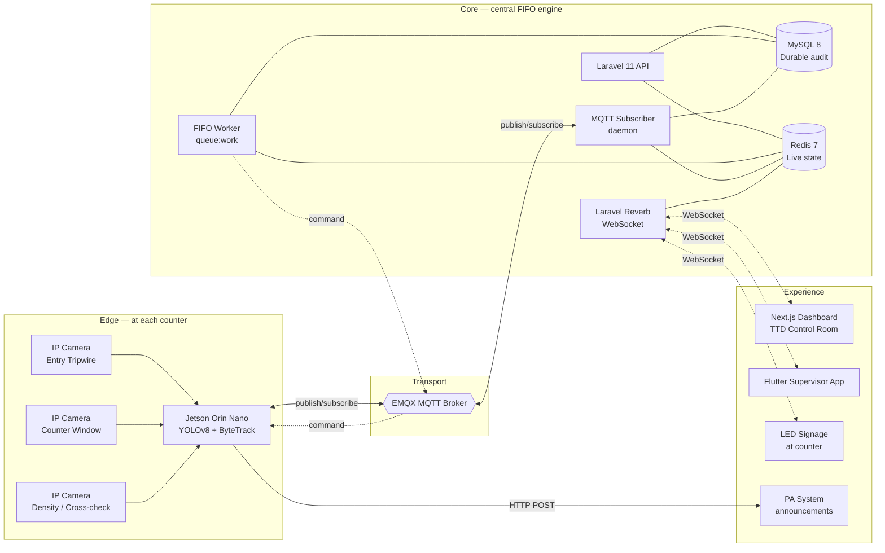

# TrioSense — System Architecture

> **Audience.** Engineers picking up the codebase for the first time. Read this end-to-end before writing any code.

> **Version.** v1.0 — pilot architecture for TTD SSD counters (Vishnu Nivasam, Srinivasam, Bhudevi Complex).

---

## 1. System overview

TrioSense is a distributed system with four layers:

1. **Edge layer** — vision-capable devices at each counter, running people-counting inference.
2. **Transport layer** — MQTT for edge → core, WebSocket for core → UI.
3. **Core layer** — Laravel backend, MySQL durable store, Redis live state, FIFO worker.
4. **Experience layer** — TTD dashboard (web), supervisor app (mobile), counter signage (LED), PA system.



---

## 2. Component responsibilities

### 2.1 Edge service (`apps/edge`)

**Runs on:** NVIDIA Jetson Orin Nano 8GB at each counter location.

**Responsibilities:**
- Pull RTSP streams from 3–4 IP cameras (Hikvision/Dahua).
- Run YOLOv8n inference at 1080p, 15 FPS, with ByteTrack for multi-object tracking.
- Emit a discrete event each time a person crosses a configured tripwire line (entry counter) or each time a token is observed being handed across the counter window.
- Buffer events locally in SQLite if MQTT broker is unreachable.
- Publish events and heartbeats to MQTT.
- Subscribe to command topics (close tripwire, play announcement, calibrate).

**Key non-functional requirements:**
- Local autonomy: must continue counting even if uplink is dead for 24 hours.
- Failure mode: if inference quality drops below a threshold, mark stream as DEGRADED and stop publishing IN/OUT events for that stream (heartbeat still flows).
- Power: must boot to operational state in <90 seconds after UPS recovery.

### 2.2 Backend (`apps/backend`)

**Runs on:** AP State Data Centre / NIC cloud (production), AWS Mumbai DR, Docker locally.

**Subcomponents:**
- `apps/backend/app/Http` — REST API for dashboard, mobile, and admin operations.
- `apps/backend/app/Domain/Fifo` — pure FIFO state machine logic (unit-testable, no I/O).
- `apps/backend/app/Jobs/FifoTickJob` — periodic recalculation triggered every 1 second.
- `apps/backend/app/Mqtt` — MQTT subscriber daemon, runs as a long-lived Artisan command.
- `apps/backend/app/Broadcasting` — Reverb broadcasters for live state push to dashboards.

**Key non-functional requirements:**
- All FIFO logic must be deterministic and replayable from `queue_events`.
- All MQTT-received events must be persisted to `queue_events` before any side effect fires.
- Redis is treated as a derived cache — losing Redis must not lose any decision-making data, only require a brief rebuild from `queue_events`.

### 2.3 Dashboard (`apps/dashboard`)

**Runs on:** Vercel-style edge (Cloudflare Pages or Vercel) or Nginx behind the same domain as backend.

**Responsibilities:**
- Live counter view (head, tail, cutoff, tokens remaining) for all three locations.
- Historical view (cutoff predictions vs actuals, hourly heatmap).
- Operator controls (pause cutoff, override quota, force re-sync).
- Festival mode toggle.

**Tech:** Next.js 15 App Router, React 19, Tailwind 4, shadcn/ui, Recharts, Laravel Echo client for Reverb.

### 2.4 Mobile (`apps/mobile`)

**Runs on:** Android (primary), iOS (best-effort) — for TTD EO and shift supervisors.

**Responsibilities:**
- Push notifications when a counter is approaching cutoff (configurable thresholds).
- View live counter state.
- Acknowledge cutoff and override controls.

**Tech:** Flutter 3.24, feature-first BLoC architecture, Hive for offline cache, Firebase Cloud Messaging for push.

### 2.5 Signage (`apps/signage`)

**Runs on:** Industrial Android player or small x86 SBC connected to the outdoor LED panel.

**Responsibilities:**
- Render the current public-facing message ("Last guaranteed token: #5,000") in Telugu, Tamil, Hindi, English with auto-rotation.
- Subscribe to Reverb channel for the location.
- Failover to a static "Counter open — please join the queue" message if WebSocket is down for >30s.

**Tech:** Pure HTML + vanilla JS, WebSocket client. Kept dead-simple intentionally — no build step.

---

## 3. Data flow — the happy path

### 3.1 A devotee joins the queue at Bhudevi Complex

```
1. Devotee crosses the entry tripwire (overhead camera frame).
2. Edge (Jetson) detects crossing via YOLOv8 + ByteTrack tripwire logic.
3. Edge publishes MQTT message:
       topic:   triosense/loc/3/event/enter
       payload: {"device_id":"edge-bdv-01","occurred_at":"2026-06-20T06:42:13.123Z",
                 "track_id":"trk-9842","confidence":0.94}
4. Backend MQTT subscriber receives message.
5. Subscriber inserts row into queue_events table (durable audit).
6. Subscriber atomically INCRs Redis key triosense:loc:3:queue_tail.
7. FIFO tick worker (running every 1s) reads Redis state for loc 3.
8. Worker calculates: if (tail - head) >= tokens_remaining, set cutoff position.
9. If cutoff changed, worker:
   - inserts row into cutoff_events
   - broadcasts new state via Reverb on channel location.3
   - publishes command MQTT message back to edge if entry tripwire should close
   - publishes announcement command if cutoff was reduced
10. Dashboard, mobile app, and signage receive WebSocket state update.
```

### 3.2 A token is issued at the counter

```
1. Counter operator hands token to devotee (counter camera detects event).
2. Edge publishes:
       topic:   triosense/loc/3/event/issue
       payload: {"device_id":"edge-bdv-01","occurred_at":"...","confidence":0.91}
3. Backend inserts row into queue_events with event_type='ISSUE'.
4. Backend atomically DECRs Redis triosense:loc:3:tokens_remaining
   AND INCRs triosense:loc:3:queue_head.
5. FIFO tick worker recalculates cutoff (may move forward).
6. State broadcast to all subscribers.
```

### 3.3 Reconciliation against ground truth (later)

Once integration with TTD's Aadhaar token issuance system is approved, the backend will additionally consume token-issued events from TTD's source-of-truth API and reconcile against the camera-derived counts every 5 minutes. Discrepancies above a threshold raise an operations alert.

---

## 4. State model

### 4.1 Durable state (MySQL)

Used for audit, replay, historical analysis. Never the source of truth for the live cutoff decision.

| Table | Purpose |
| --- | --- |
| `tenants` | Multi-tenancy root. TTD = tenant 1. Future temple trusts = tenant 2+. |
| `locations` | The three SSD counter locations. |
| `counters` | Individual counter windows within a location. |
| `daily_quotas` | Per-location daily token quota (set by TTD ops). |
| `edge_devices` | Registered Jetson units, one per location. |
| `cameras` | RTSP streams per edge device, with role assignment. |
| `queue_events` | Immutable log of every detected crossing or issuance. |
| `cutoff_events` | Immutable log of cutoff decisions (predictions and adjustments). |
| `announcements` | Log of every PA announcement played. |
| `users` / `roles` / `permissions` | RBAC for dashboard and mobile. |
| `audit_logs` | Operator action log (overrides, quota changes, manual closes). |

Full DDL in [`DATABASE_SCHEMA.md`](./DATABASE_SCHEMA.md).

### 4.2 Live state (Redis)

Used for the cutoff decision loop. All keys are scoped per location and TTL'd to end of operating day.

| Key pattern | Type | Value |
| --- | --- | --- |
| `triosense:loc:{id}:quota` | int | Daily quota (e.g. 5000) |
| `triosense:loc:{id}:issued` | int | Tokens issued so far today |
| `triosense:loc:{id}:tokens_remaining` | int | `quota - issued` (derived but cached) |
| `triosense:loc:{id}:queue_head` | int | Position number of person currently at the counter |
| `triosense:loc:{id}:queue_tail` | int | Position number of the last person to join the queue |
| `triosense:loc:{id}:cutoff` | int \| null | The position number of the last guaranteed token holder |
| `triosense:loc:{id}:status` | string | `OPEN`, `APPROACHING_CUTOFF`, `CUTOFF_DECLARED`, `CLOSED` |
| `triosense:loc:{id}:last_event_at` | unix ms | Watchdog for staleness |
| `triosense:loc:{id}:edge:{device_id}:hb` | unix ms | Heartbeat timestamp per device |

**Atomicity.** Updates that span multiple keys (e.g. an ISSUE event decrements both `tokens_remaining` and `queue_head`) MUST use a Lua script or a MULTI/EXEC block. Never two separate calls.

**Recovery.** On Redis cold start, the backend rebuilds all live keys by replaying `queue_events` for the current operating day. This is implemented in `RehydrateLiveStateJob`.

---

## 5. The FIFO decision loop

This is the heart of the system. Documented here in plain language; canonical implementation lives in `apps/backend/app/Domain/Fifo/CutoffCalculator.php`.

### 5.1 Inputs (per location)

- `quota` — daily token quota (operator-set)
- `issued` — tokens issued so far today (from ISSUE events)
- `queue_head` — counter position
- `queue_tail` — last-joiner position
- `issuance_rate_per_min` — rolling 5-minute average from ISSUE events
- `arrival_rate_per_min` — rolling 5-minute average from ENTER events
- `now` — current timestamp
- `closes_at` — counter close time (defaults to noon, configurable)

### 5.2 Derived values

```
tokens_remaining     = quota - issued
queue_length         = max(0, queue_tail - queue_head)
minutes_to_serve_all = queue_length / issuance_rate_per_min
minutes_to_quota_end = tokens_remaining / issuance_rate_per_min
```

### 5.3 Decision

```
IF tokens_remaining == 0:
    status = CLOSED
    cutoff = queue_head

ELSE IF queue_length >= tokens_remaining:
    # The people already in queue exceed remaining tokens.
    status = CUTOFF_DECLARED
    cutoff = queue_head + tokens_remaining - 1

ELSE IF (queue_length + arrival_rate_per_min * minutes_to_quota_end) >= tokens_remaining:
    # On current arrival rate, we will exceed remaining tokens before quota end.
    status = APPROACHING_CUTOFF
    cutoff = null  # Will declare once condition tightens.

ELSE:
    status = OPEN
    cutoff = null
```

### 5.4 Side effects on status change

| Transition | Action |
| --- | --- |
| `OPEN → APPROACHING_CUTOFF` | Broadcast new state. Play "75% quota issued" announcement (configurable). |
| `APPROACHING_CUTOFF → CUTOFF_DECLARED` | Broadcast new state. Send MQTT command to edge to close entry tripwire. Play "Last token position #X" announcement in all 4 languages. Push notification to supervisors. |
| `CUTOFF_DECLARED → CLOSED` | Broadcast. Final closure announcement. Update `daily_quotas.closed_at`. |
| Any → any (cutoff moves forward) | Broadcast. Re-announce updated cutoff position. |

### 5.5 Shadow mode

During pilot rollout (first 2 weeks), `cutoff` is calculated and persisted but the entry tripwire command is **suppressed** and announcements use a "test" prefix. This lets the ops team compare predicted cutoff against actual counter-close events without affecting devotee experience.

Controlled by `App\Domain\Fifo\Mode::SHADOW` vs `Mode::LIVE` (env-driven per location).

---

## 6. Failure modes & resilience

| Failure | Impact | Mitigation |
| --- | --- | --- |
| Edge → MQTT broker network drop | Edge cannot publish events | Edge buffers in local SQLite, replays on reconnect (max 24h, then drops oldest) |
| MQTT broker down | No events flow | EMQX HA pair behind keepalived; if both down, edge enters STANDBY and signage shows "System reconnecting" |
| Backend down | No FIFO decisions | Edge entry tripwires default to OPEN. Operators told to manage by feel. |
| Redis cold start | Live state lost | `RehydrateLiveStateJob` replays today's `queue_events` from MySQL |
| MySQL down | Cannot persist events | MQTT subscriber pauses, edges back-buffer, op-page raised. No silent loss. |
| Camera lens obscured / lighting bad | Counts drift | Edge detects via confidence drop, marks DEGRADED, alerts dashboard. Operations falls back to manual queue cards. |
| Internet WAN down at counter | Edge cannot reach broker | 4G/5G failover router takes over within 30s; if both fail, edge runs autonomously |
| Power cut | Edge dies | UPS sustains 30 min; if longer, graceful shutdown; on power-back, autostart in <90s |
| Cutoff predicted wrong | Devotee turned away who would have gotten a token | Shadow mode validates for 14+ days before live cutover. Ops can disable cutoff at any time from dashboard. |

---

## 7. Security

- **Network.** Edge devices on a dedicated VLAN. MQTT over TLS only (`mqtts://`). REST API over HTTPS only.
- **AuthN.** Operators authenticate via Laravel Sanctum. Edge devices authenticate to MQTT broker via per-device client certificates.
- **AuthZ.** Spatie Laravel Permission. Roles: `super_admin`, `ttd_admin`, `location_supervisor`, `location_operator`, `viewer`.
- **PII.** Only camera frames are processed; **no faces are stored, no images are persisted** beyond a 30-second debug rolling buffer (env-gated, off in production).
- **Audit.** Every operator action (quota change, override, manual close) writes to `audit_logs` with user, IP, before/after state.
- **Secrets.** All secrets in environment variables, never in code. Production secrets in AP State KMS / AWS Secrets Manager.

---

## 8. Deployment topology

### 8.1 Pilot (Phase 1)

```
┌──────────────────────────┐         ┌──────────────────────────┐
│  Bhudevi Complex (counter)│         │  AP State Data Centre   │
│  ┌────────────────┐       │         │                          │
│  │ Cameras (4)    │       │         │  ┌──────────────────┐   │
│  │ Jetson Orin    │──TLS──┼─Internet┼──│ EMQX MQTT        │   │
│  │ LED signage    │       │  +5G    │  │ Laravel API      │   │
│  │ PA system      │       │  failover│ │ MySQL + Redis    │   │
│  └────────────────┘       │         │  │ Reverb           │   │
└──────────────────────────┘         │  └──────────────────┘   │
                                      │         │                │
                                      │  ┌──────▼──────────┐    │
                                      │  │ Next.js         │    │
                                      │  │ Dashboard       │    │
                                      │  └─────────────────┘    │
                                      └──────────────────────────┘
                                                  │
                                                  ▼
                                      ┌──────────────────────────┐
                                      │  TTD EO + Supervisors    │
                                      │  (web + mobile)          │
                                      └──────────────────────────┘
```

### 8.2 Three-counter (Phase 2)

Same as above, replicated at Vishnu Nivasam and Srinivasam. Central core handles all three locations.

---

## 9. Decisions log

See `docs/adr/` for Architecture Decision Records. Highlights:

- **ADR-001:** Why MQTT and not just HTTP webhooks for edge → core
- **ADR-002:** Why Redis is the live decision surface, not MySQL
- **ADR-003:** Why ByteTrack and not DeepSORT for ByteTrack
- **ADR-004:** Why Laravel Reverb and not Pusher / Soketi
- **ADR-005:** Why we keep cameras counting events, not estimating density (overhead tripwire, not crowd-density model)

---

## 10. What is intentionally NOT in v1

- Face recognition. Not needed for queue counting and would create regulatory burden.
- Public-facing devotee mobile app showing live counter status. Planned for Phase 3 once accuracy is proven.
- Direct integration with TTD's Aadhaar token system. Planned for Phase 3 with a signed API agreement.
- Predictive ML for festival days. Use rule-based festival mode in v1.
- Multi-tenant SaaS billing. Tenant scaffolding is in place but only TTD will exist as a tenant in v1.
